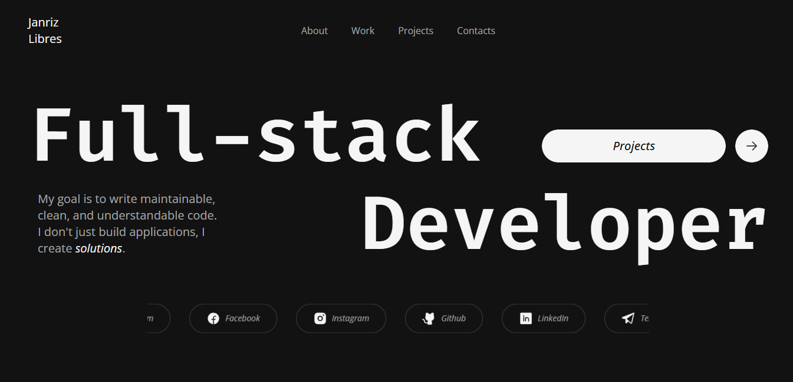

# Developer Portfolio

## 🌐 Link

Here is the live site: http://janrizlibres.vercel.app/

## 📝 Description

This repository contains the source code for my personal developer portfolio. It was built from scratch using React, Vite, and TypeScript to create a modern, performant, and visually engaging single-page application. The portfolio serves as a central hub to showcase my skills, featured projects, and professional work experience through a clean, fully responsive, and animated interface.

## 📖 Table of Contents

- [🌐 Link](#-link)
- [📝 Description](#-description)
- [✨ Features](#-features)
- [💻 Technologies Used](#️-technologies-used)
- [📩 Bug Report](#-bug-report)
- [📞 Contact Me](#-contact-me)
- [📋 License](#-license)

## ✨ Features

👉 **Modern & Responsive Design**: Built with Tailwind CSS for a seamless, mobile-first experience that adapts perfectly to any screen size.

👉 **Smooth Animations**: Leverages the motion library to implement engaging scroll-based and interactive animations throughout the site, providing a dynamic user experience.

👉 **Dynamic Project Showcase**: A detailed section presenting projects like DevFlow and PulseVR with complex, visually appealing layouts.

👉 **Skills & Experience**: Clearly defined sections for technical skills across the full stack (frontend, backend, DevOps) and a timeline of my work history.

👉 **Infinite Socials Marquee**: An eye-catching, auto-scrolling marquee that displays social media links in an infinite loop.

## 💻 Technologies Used

- [![React][React.js]][React-url]
- [![TypeScript][TypeScript]][TypeScript-url]
- [![Vite][Vite]][Vite-url]
- [![TailwindCSS][TailwindCSS]][TailwindCSS-url]

## 📩 Bug Report

If you find a bug, kindly open an issue [here](https://github.com/janrizmlibres/dev-portfolio/issues/new) by including a description of your problem and the expected result.

## 📞 Contact Me

## 📋 License

[MIT](https://choosealicense.com/licenses/mit/)
Released 2025 by Janriz Libres @janrizmlibres

[React.js]: https://img.shields.io/badge/react-%2320232a.svg?style=for-the-badge&logo=react&logoColor=%2361DAFB
[React-url]: https://react.dev/
[TypeScript]: https://img.shields.io/badge/typescript-%23007ACC.svg?style=for-the-badge&logo=typescript&logoColor=white
[TypeScript-url]: https://www.typescriptlang.org/
[Vite]: https://img.shields.io/badge/vite-%23646CFF.svg?style=for-the-badge&logo=vite&logoColor=white
[Vite-url]: https://vite.dev/
[TailwindCSS]: https://img.shields.io/badge/tailwindcss-%2338B2AC.svg?style=for-the-badge&logo=tailwind-css&logoColor=white
[TailwindCSS-url]: https://tailwindcss.com/
